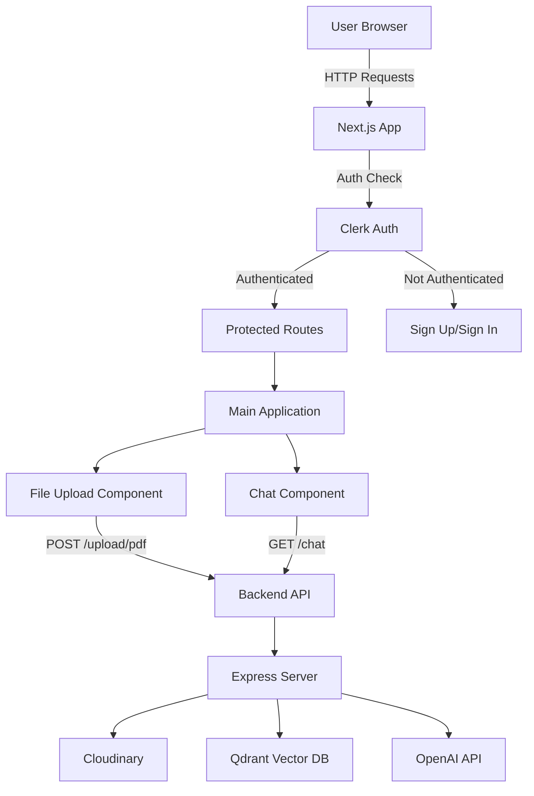
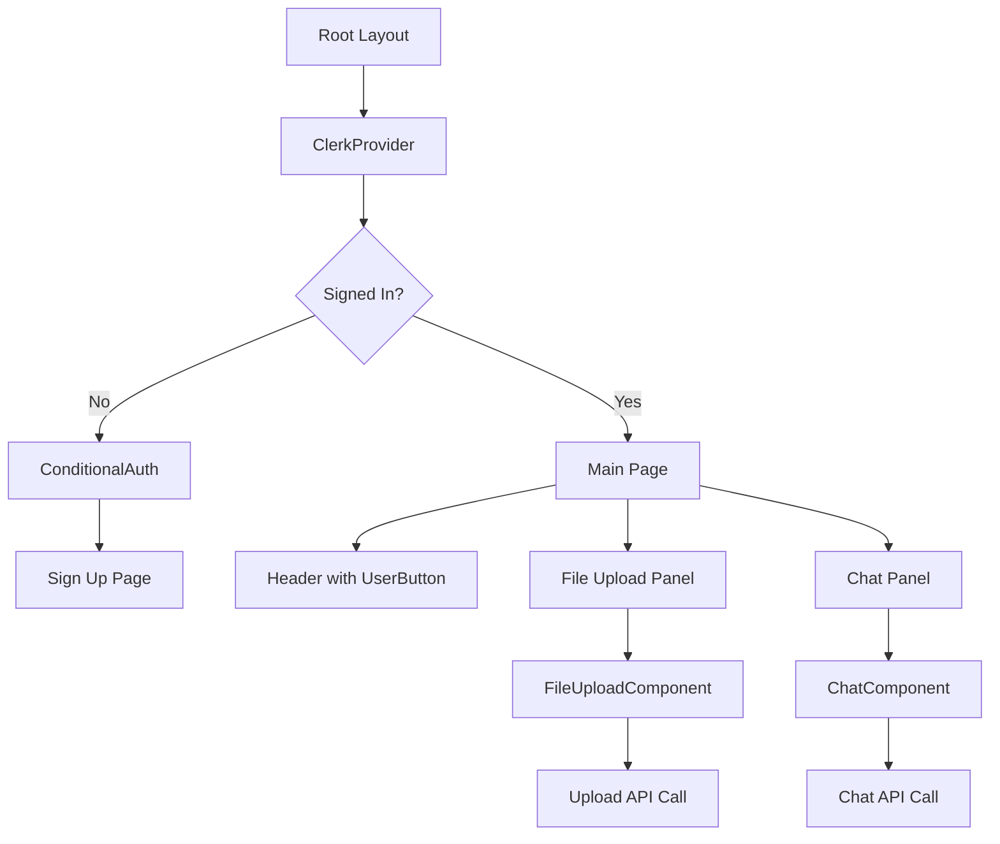
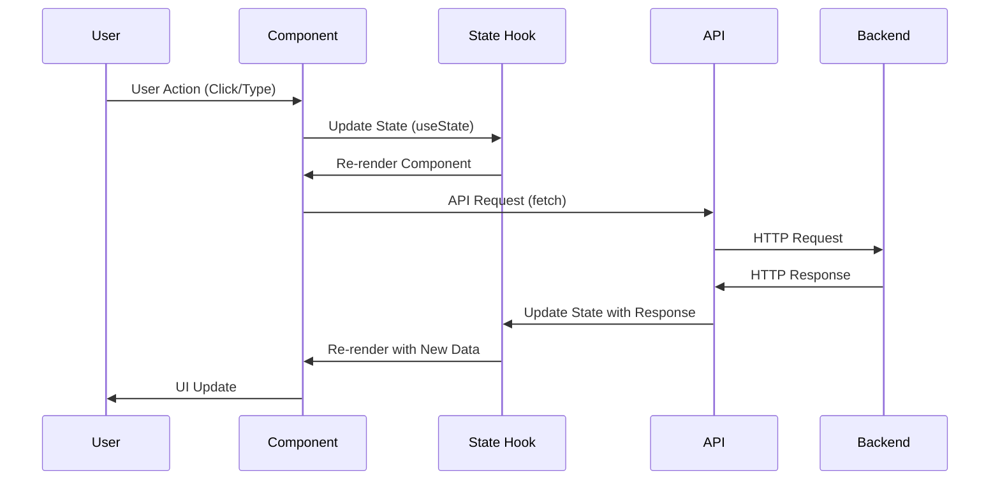
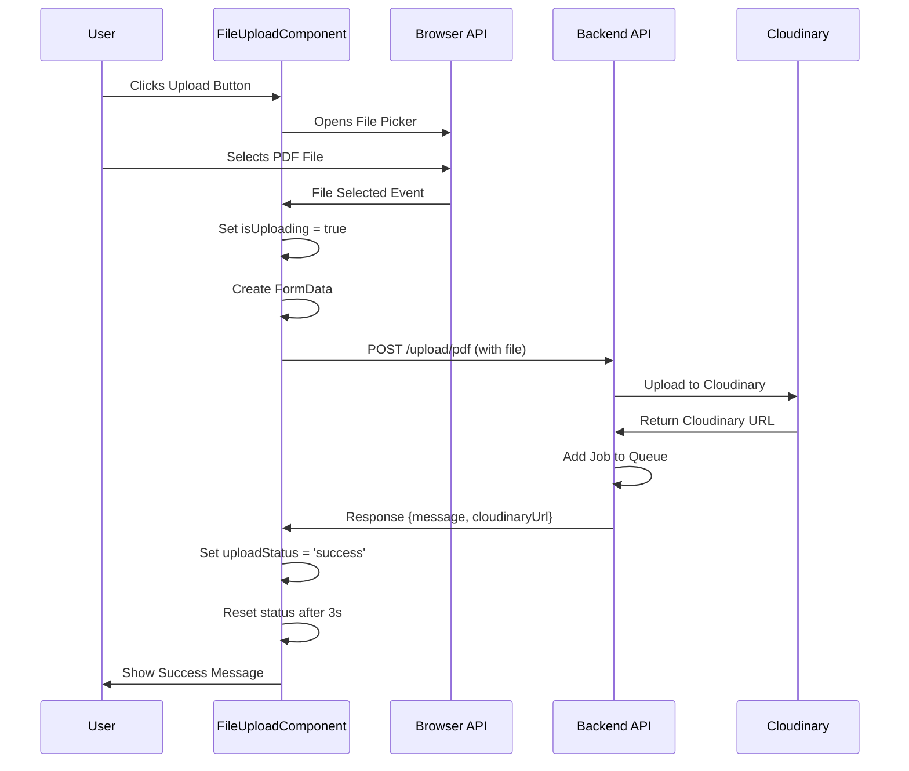
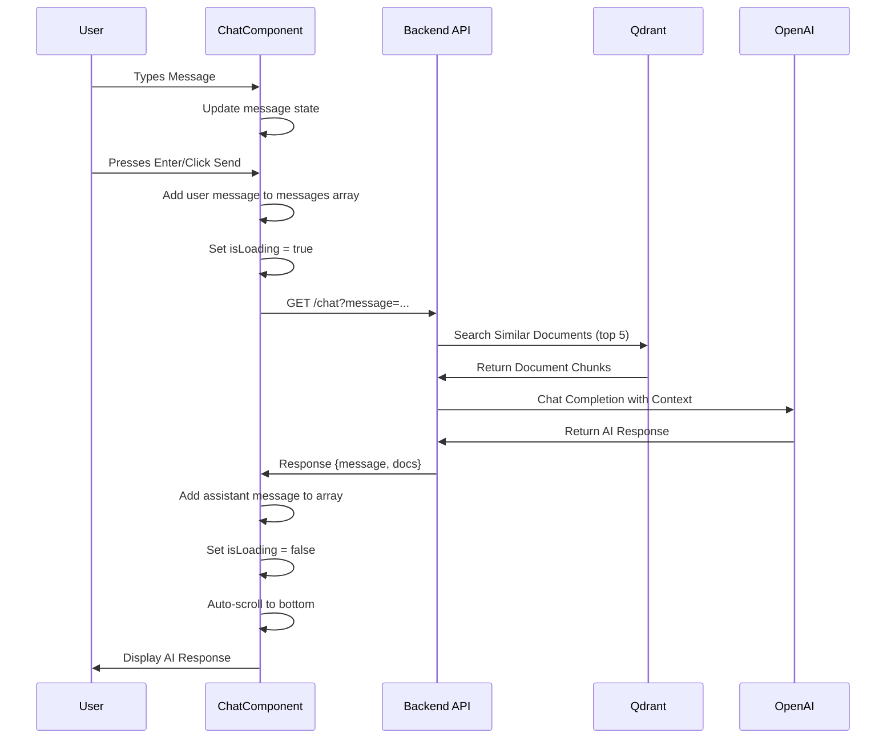
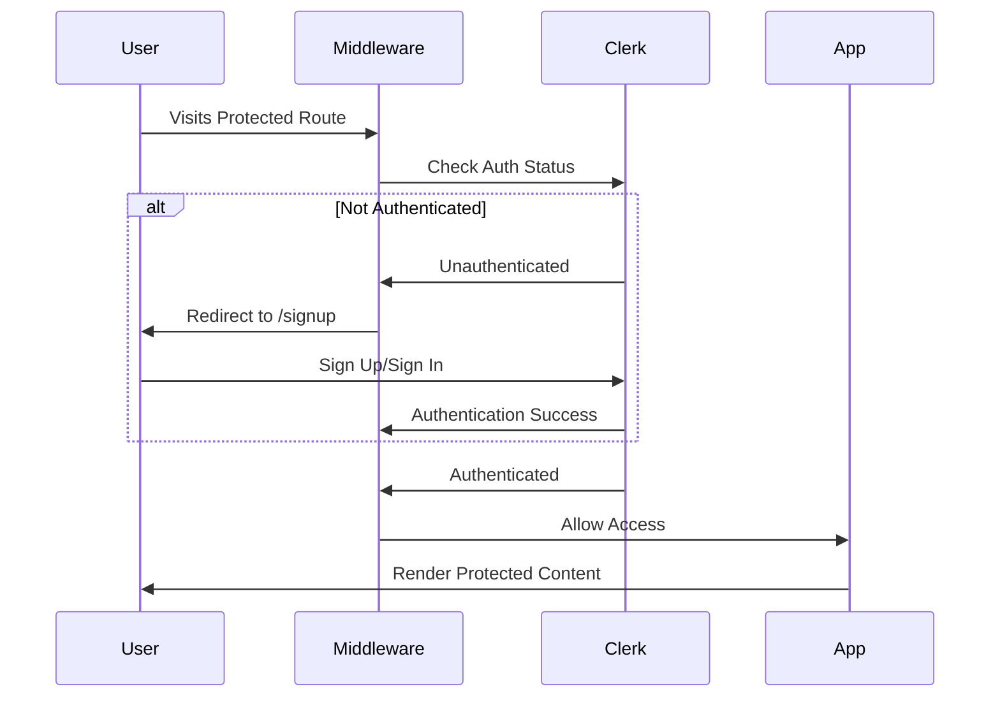
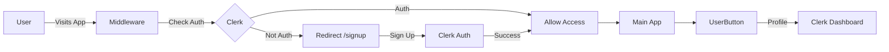

# PDF RAG Chat - Client Application

A modern Next.js-based frontend application for interacting with PDF documents using AI-powered Retrieval-Augmented Generation (RAG). This client provides an intuitive interface for uploading PDF files and chatting with an AI assistant that answers questions based on the document content.

## 📋 Table of Contents

- [Overview](#overview)
- [Tech Stack](#tech-stack)
- [Features](#features)
- [Project Structure](#project-structure)
- [Prerequisites](#prerequisites)
- [Installation](#installation)
- [Environment Variables](#environment-variables)
- [Development Workflow](#development-workflow)
- [Application Architecture](#application-architecture)
- [Component Workflows](#component-workflows)
- [API Integration](#api-integration)
- [Authentication Flow](#authentication-flow)
- [Build & Deployment](#build--deployment)
- [Troubleshooting](#troubleshooting)

## 🎯 Overview

The client application is a Next.js 15 application built with React 19, TypeScript, and Tailwind CSS. It provides a split-screen interface where users can:
- Upload PDF documents (left panel - 30% width)
- Chat with an AI assistant about the uploaded documents (right panel - 70% width)
- Authenticate using Clerk authentication system

The application communicates with a backend Express server that handles PDF processing, vector storage, and AI chat functionality.

## 🛠 Tech Stack

- **Framework**: Next.js 15.3.8 (App Router)
- **Language**: TypeScript 5
- **UI Library**: React 19.0.0
- **Styling**: Tailwind CSS 4
- **Authentication**: Clerk (@clerk/nextjs 6.15.0)
- **UI Components**: 
  - Radix UI (@radix-ui/react-slot 1.2.0)
  - Lucide React 0.488.0 (icons)
  - Custom UI components (Button, Input)
- **State Management**: React Hooks (useState, useEffect, useRef)
- **Build Tool**: Turbopack (via Next.js)
- **Utilities**: 
  - clsx 2.1.1 (class name utilities)
  - tailwind-merge 3.2.0 (Tailwind class merging)
  - class-variance-authority 0.7.1 (component variants)

## ✨ Features

1. **User Authentication**
   - Clerk-based authentication system
   - Protected routes with middleware
   - Sign-up and sign-in pages
   - User profile management via UserButton

2. **PDF Upload**
   - Click-to-upload interface
   - Real-time upload status feedback
   - Support for PDF files only
   - Visual feedback (loading, success, error states)
   - Automatic status reset after 3 seconds

3. **AI Chat Interface**
   - Real-time chat with AI assistant
   - Message history display with role-based styling
   - Source document references display
   - Loading indicators during API calls
   - Auto-scroll to latest message
   - Responsive design

4. **Modern UI/UX**
   - Gradient-based design system
   - Smooth animations and transitions
   - Dark mode support (via Tailwind)
   - Responsive layout
   - Accessible components

## 📁 Project Structure

```
client/
├── app/
│   ├── components/
│   │   ├── auth-redirect.tsx      # Auth redirect logic component
│   │   ├── chat.tsx                # Main chat component with message handling
│   │   ├── conditional-auth.tsx    # Conditional auth wrapper for signed-out users
│   │   └── file-upload.tsx         # PDF upload component with status management
│   ├── signup/
│   │   └── [[...rest]]/
│   │       └── page.tsx            # Clerk signup page (catch-all route)
│   ├── globals.css                 # Global styles and Tailwind directives
│   ├── layout.tsx                  # Root layout with ClerkProvider
│   └── page.tsx                    # Main home page with split layout
├── components/
│   └── ui/
│       ├── button.tsx              # Reusable button component with variants
│       └── input.tsx               # Reusable input component
├── lib/
│   └── utils.ts                    # Utility functions (cn helper for classNames)
├── middleware.ts                   # Auth middleware for route protection
├── next.config.ts                  # Next.js configuration
├── package.json                    # Dependencies and scripts
├── tsconfig.json                   # TypeScript configuration
└── README.md                       # This file
```

## 📋 Prerequisites

Before you begin, ensure you have:

- **Node.js** 18.x or higher
- **npm**, **yarn**, **pnpm**, or **bun** package manager
- **Clerk Account** - For authentication (sign up at [clerk.com](https://clerk.com))
- **Backend Server** - The Express server should be running (see server README.md)

## 🚀 Installation

1. **Navigate to the client directory**:
   ```bash
   cd client
   ```

2. **Install dependencies**:
   ```bash
   npm install
   # or
   pnpm install
   # or
   yarn install
   ```

3. **Set up environment variables** (see [Environment Variables](#environment-variables) section)

4. **Start the development server**:
   ```bash
   npm run dev
   # or
   pnpm dev
   ```

5. **Open your browser**:
   Navigate to [http://localhost:3000](http://localhost:3000)

## 🔐 Environment Variables

Create a `.env.local` file in the `client` directory with the following variables:

```env
# Backend API URL
NEXT_PUBLIC_API_URL=http://localhost:8000

# Clerk Authentication
NEXT_PUBLIC_CLERK_PUBLISHABLE_KEY=pk_test_...
CLERK_SECRET_KEY=sk_test_...
```

### Getting Clerk Keys

1. Sign up/login at [clerk.com](https://clerk.com)
2. Create a new application
3. Copy the **Publishable Key** and **Secret Key** from the dashboard
4. Add them to your `.env.local` file

**Note**: Never commit `.env.local` to version control. It's already in `.gitignore`.

## 🔄 Development Workflow

### Starting Development Server

```bash
npm run dev
```

This starts the Next.js development server with Turbopack on `http://localhost:3000`.

### Available Scripts

- `npm run dev` - Start development server with Turbopack (fast refresh enabled)
- `npm run build` - Build production bundle
- `npm start` - Start production server (after build)
- `npm run lint` - Run ESLint for code quality

### Development Features

- **Hot Module Replacement (HMR)** - Changes reflect immediately without full page reload
- **Fast Refresh** - React components update without losing state
- **TypeScript Type Checking** - Real-time type errors in terminal and editor
- **Turbopack** - Fast bundling and compilation (faster than Webpack)

## 🏛 Application Architecture

### High-Level Architecture



### Component Hierarchy



### State Management Flow



## 🔄 Component Workflows

### File Upload Workflow



### Chat Workflow



### Authentication Workflow



## 🔌 API Integration

### Upload PDF Endpoint

**Endpoint**: `POST /upload/pdf`

**Request**:
```typescript
const formData = new FormData();
formData.append('pdf', file);

const response = await fetch(`${apiUrl}/upload/pdf`, {
  method: 'POST',
  body: formData,
});
```

**Response**:
```typescript
{
  message: 'uploaded',
  cloudinaryUrl: 'https://res.cloudinary.com/...'
}
```

**Error Handling**:
- Network errors caught in try-catch
- HTTP errors checked with `response.ok`
- Error state displayed to user

### Chat Query Endpoint

**Endpoint**: `GET /chat?message={query}`

**Request**:
```typescript
const response = await fetch(
  `${apiUrl}/chat?message=${encodeURIComponent(userMessage)}`
);
const data = await response.json();
```

**Response**:
```typescript
{
  message: 'AI response text...',
  docs: [
    {
      pageContent: 'Document chunk text...',
      metadata: {
        page: 1,
        source: 'filename.pdf'
      }
    }
  ]
}
```

**Error Handling**:
- Query parameter validation
- Network error handling
- Empty response handling
- User-friendly error messages

## 🔐 Authentication Flow

### Clerk Integration Architecture



### Route Protection

**Public Routes**:
- `/` - Home page (redirects to signup if not authenticated)
- `/signup` - Sign up page
- `/sign-in` - Sign in page

**Protected Routes**:
- All other routes require authentication
- Middleware automatically redirects unauthenticated users

### Authentication Components

1. **ClerkProvider** (`layout.tsx`):
   - Wraps entire application
   - Provides auth context to all components

2. **Middleware** (`middleware.ts`):
   - Runs on every request
   - Checks authentication status
   - Protects routes

3. **ConditionalAuth** (`conditional-auth.tsx`):
   - Wraps content for signed-out users
   - Redirects to signup if needed

4. **UserButton** (`page.tsx`):
   - Displays user avatar
   - Provides profile menu
   - Sign out functionality

## 🏗 Build & Deployment

### Building for Production

```bash
npm run build
```

This creates an optimized production build in the `.next` directory with:
- Code splitting
- Tree shaking
- Minification
- Image optimization
- Font optimization

### Deploying to Vercel

1. **Connect Repository**:
   - Push code to GitHub
   - Import project in Vercel dashboard

2. **Configure Project**:
   - **Framework Preset**: Next.js
   - **Root Directory**: `client`
   - **Build Command**: `npm run build` (default)
   - **Output Directory**: `.next` (default)
   - **Install Command**: `npm install` (default)

3. **Set Environment Variables**:
   ```
   NEXT_PUBLIC_API_URL=https://your-backend.onrender.com
   NEXT_PUBLIC_CLERK_PUBLISHABLE_KEY=pk_live_...
   CLERK_SECRET_KEY=sk_live_...
   ```

4. **Deploy**:
   - Click "Deploy"
   - Wait for build to complete
   - Your app will be live at `https://your-app.vercel.app`

### Post-Deployment Checklist

- [ ] Update Clerk Allowed Origins with Vercel URL
- [ ] Update Backend CORS_ORIGIN with Vercel URL
- [ ] Test authentication flow
- [ ] Test PDF upload
- [ ] Test chat functionality
- [ ] Verify environment variables are set
- [ ] Check build logs for errors

## 🐛 Troubleshooting

### Common Issues

#### 1. "API URL not found" or CORS Errors

**Symptoms**: Network errors, CORS errors in console

**Solutions**:
- Check `NEXT_PUBLIC_API_URL` in `.env.local`
- Ensure backend server is running
- Verify CORS is configured correctly in backend
- Check browser Network tab for actual request URL

#### 2. Authentication Not Working

**Symptoms**: Redirect loops, auth errors

**Solutions**:
- Verify Clerk keys are correct
- Check Clerk dashboard for allowed origins
- Clear browser cache and cookies
- Verify middleware configuration
- Check Clerk dashboard logs

#### 3. Upload Fails

**Symptoms**: Upload button shows error, no file uploaded

**Solutions**:
- Check file size (should be reasonable)
- Verify backend is running
- Check browser console for errors
- Verify Cloudinary credentials in backend
- Check Network tab for API response

#### 4. Chat Not Responding

**Symptoms**: No response, loading forever

**Solutions**:
- Check backend logs
- Verify Qdrant connection
- Ensure PDFs have been uploaded first
- Check OpenAI API key in backend
- Verify API URL is correct
- Check browser Network tab for request/response

#### 5. Build Errors

**Symptoms**: Build fails, TypeScript errors

**Solutions**:
- Run `npm install` to ensure dependencies are installed
- Check TypeScript errors: `npm run lint`
- Verify Node.js version (18+)
- Clear `.next` folder and rebuild
- Check for missing environment variables

### Debug Tips

1. **Browser DevTools**:
   - Network tab: Check API calls and responses
   - Console tab: Check for JavaScript errors
   - Application tab: Check localStorage, cookies

2. **React DevTools**:
   - Inspect component state
   - Check props and hooks
   - Monitor re-renders

3. **Next.js Debug Mode**:
   ```bash
   DEBUG=* npm run dev
   ```

4. **Check Logs**:
   - Browser console for client-side errors
   - Terminal for build/compilation errors
   - Backend logs for API errors

## 📚 Additional Resources

- [Next.js Documentation](https://nextjs.org/docs)
- [Clerk Documentation](https://clerk.com/docs)
- [Tailwind CSS Documentation](https://tailwindcss.com/docs)
- [React Documentation](https://react.dev)
- [TypeScript Documentation](https://www.typescriptlang.org/docs)

## 📝 License

ISC

## 👥 Contributing

1. Fork the repository
2. Create a feature branch (`git checkout -b feature/amazing-feature`)
3. Make your changes
4. Test thoroughly
5. Commit your changes (`git commit -m 'Add amazing feature'`)
6. Push to the branch (`git push origin feature/amazing-feature`)
7. Open a Pull Request

---

**Note**: This client application requires the backend server to be running. See the server README.md for backend setup instructions.
